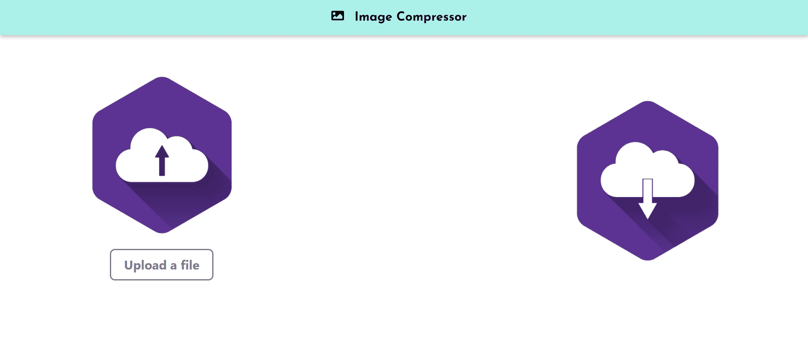

# Image Compressor

This is a Image Compressor application developed using React.js Package browser-image-compressor. This online image compressor allows to compress your JPG or PNG images to save your disk space and database space.

### Link - https://imagecompressor.netlify.app/
### Blog - [Read](https://chirag-jain.medium.com/image-compressor-website-using-react-9c7e631147ac)

## 🏁 Technology Stack

- [React](https://reactjs.org/)

## Packages Used

- browser-image-compression
- bootstrap
- react-bootstrap
- react-dom

## Key Feature
Compress your JPG and PNG images

## 🏃‍ Local Installation

1. Drop a ⭐ on the Github Repository.
2. Clone the Repo by going to your local Git Client and pushing in the command:
git clone https://github.com/mechiragjain/Image-Compressor.git
3. At last, push in the command under client-user directory which will kickstart the application on Local Host:
npm start
